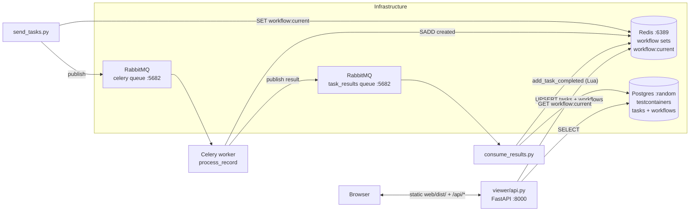

# Celery Task Viewer POC

Run a Celery workflow, persist each task's result + execution metrics to Postgres, and browse the parent/child hierarchy in a React Flow viewer.

## Architecture



Three concerns kept apart:

- **`ops/postgres/dev_db.py`** — starts a throwaway Postgres (testcontainers) with `init.sql` already applied, and publishes its conninfo to `.dev-db.env`.
- **`outbox/`** — Celery tasks, Redis-set workflow tracking, enriched result publishing.
- **`consume_results.py`** — RabbitMQ consumer. On terminal events, UPSERTs a row into Postgres with the business result and a bundled `metrics` JSONB.
- **`viewer/` + `web/`** — FastAPI backend + React Flow frontend for browsing the hierarchy.

## Services and ports

| Service  | Port                       | Purpose                                     |
| -------- | -------------------------- | ------------------------------------------- |
| RabbitMQ | 5682                       | Celery broker + `task_results` queue        |
| Redis    | 6389                       | Workflow sets + `workflow:current` pointer  |
| Postgres | random (see `.dev-db.env`) | `tasks` + `workflows` tables for the viewer |
| FastAPI  | 8000                       | API + static frontend                       |

RabbitMQ and Redis use **non-default ports** to stay out of the way of other local installs.
Postgres goes further: it is started per session by `ops/postgres/dev_db.py` on a **random** host
port, so it can never collide with — or be mistaken for — another local stack's Postgres. The
processes discover it through `.dev-db.env` (gitignored), which that script writes on startup and
deletes on exit.

## Quickstart

### First time (one-time setup)

```bash
# 1. Python deps
poetry install

# 2. Frontend deps + build
cd web && npm install && npm run build && cd ..

# 3. Bring up RabbitMQ + Redis (Postgres is NOT here — see below)
docker compose up -d
```

Postgres is deliberately **not** in `docker-compose.yml`. It is started per session by
`ops/postgres/dev_db.py` (Terminal 1 below), which creates a fresh container, applies
`ops/postgres/init.sql` to it, and throws it away on exit. There is nothing to set up by hand and
the schema can never drift from `init.sql`.

> **If you already have RabbitMQ/Redis on `:5682`/`:6389`** (e.g. from another compose stack), skip
> `docker compose up -d` — the app connects to those ports regardless of who started them.

### Every run

You need **five processes** running in parallel. Open five terminals, all from the project root, and run one command per terminal.

**Terminal 1 — Postgres** (must be up before the consumer and the API, which fail fast without it)

```bash
poetry run python ops/postgres/dev_db.py
```

It prints the container name, the random host port, and the conninfo, then stays in the foreground
until Ctrl+C. The other processes read the conninfo from the `.dev-db.env` it writes.

**Terminal 2 — Celery worker**

```bash
poetry run celery -A outbox.celery_app worker --pool=threads --concurrency=4 --loglevel=info
```

**Terminal 3 — result consumer** (persists tasks + workflow status to Postgres)

```bash
poetry run python consume_results.py
```

**Terminal 4 — API + viewer**

```bash
poetry run uvicorn viewer.api:app --host 127.0.0.1 --port 8000
```

**Terminal 5 — submit a workflow**

```bash
poetry run python -m outbox.send_tasks
```

Then open **http://localhost:8000**. The top-bar status pill shows `⏳ pending` while tasks are still running and flips to `✓ complete` once `consume_results.py` sees the last task finish. The viewer auto-polls every 2s while pending so the graph fills in live.

The default workflow is a fixed three-section profile (`start → timeline / album / videos`, each with a chain of pages). Two pages have hardcoded failures — `album/page 2` retries twice and succeeds, `timeline/page 4` fails permanently — so the retry and downstream-failure UIs stay exercised. See `outbox/README.md` for the full shape.

### Stopping

Ctrl+C the five foreground processes. Ctrl+C on Terminal 1 removes the Postgres container and
deletes `.dev-db.env` — **its data is discarded by design**, so every session starts from a schema
that matches `init.sql`. To also stop the brokers: `docker compose down`.

### After pulling code changes

```bash
poetry install                     # if pyproject.toml changed
cd web && npm install && npm run build && cd ..   # if web/ changed
# then restart the five processes (a fresh dev DB picks up ops/postgres/init.sql changes)
```

## Using the viewer

- The top bar shows a **status pill** (`⏳ pending · M/N` → `✓ complete · M/N`) and three highlight buttons: **Slowest**, **Most retries**, **Failed**. Matching nodes get a yellow outline; if a match is hidden inside a collapsed subtree, its ancestors auto-expand.
- The workflow node is the graph's single root and shows aggregates (total tasks, success/failed counts, total retries, compute time, wall time).
- Task nodes start collapsed. Click a node to toggle collapse/expand and to open the detail pane on the right; the pane shows the business result (`last_message`) and the `metrics` block.
- A successful task with failures somewhere in its subtree shows a red `⚠ N failures downstream` badge. Click the badge to expand the path down to the failure(s).

## Viewer API reference

| Method | Path                                                              | Returns                                       |
| ------ | ----------------------------------------------------------------- | --------------------------------------------- |
| GET    | `/api/workflows/current`                                          | `{workflow_id}` (from Redis), or 404          |
| GET    | `/api/workflows/{id}/status`                                      | `{status, started_at, finished_at, persisted_tasks}` |
| GET    | `/api/workflows/{id}/tasks`                                       | all persisted tasks for the workflow          |
| GET    | `/api/workflows/{id}/tasks/{task_id}`                             | one task with `last_message + metrics`        |
| GET    | `/api/workflows/{id}/highlights?by=slowest\|most_retries\|failed` | sorted/filtered task_ids                      |

## Verifying a run from the CLI

The container gets a random name, printed by `ops/postgres/dev_db.py` on startup. Use that name, or
look it up by the testcontainers label:

```bash
PG=$(docker ps -q -f label=org.testcontainers=true -f ancestor=postgres:17-alpine)

# workflow status
docker exec -e PGPASSWORD=celery $PG \
  psql -U celery -d celery_viewer -c "
    SELECT workflow_id, status, started_at, finished_at FROM workflows
    ORDER BY started_at DESC LIMIT 5;"

# tasks for the latest workflow
docker exec -e PGPASSWORD=celery $PG \
  psql -U celery -d celery_viewer -c "
    SELECT label, final_status,
           metrics->>'retry_count'       AS retries,
           metrics->>'total_duration_ms' AS duration_ms
    FROM tasks
    WHERE workflow_id = (SELECT workflow_id FROM workflows
                         ORDER BY started_at DESC LIMIT 1)
    ORDER BY created_at;"
```

Expected for the default profile workflow once it finishes: one `workflows` row with `status = 'complete'` and `finished_at` set, and 12 `tasks` rows. Every row has a non-null `parent_task_id` (the root task's parent is the workflow id). The `album/page 2` row has `retries=2`, the `timeline/page 4` row has `final_status = 'permanent_failure'`, and `timeline/page 5` is absent (its chain stopped at the failure).

## File layout

```
.
├── outbox/                  Celery app + workflow tracking
│   └── README.md
├── viewer/                  FastAPI backend
│   └── README.md
├── web/                     React Flow frontend
│   └── README.md
├── consume_results.py       RabbitMQ consumer + Postgres persister
├── db.py                    Shared Postgres pool + conninfo resolution
├── ops/postgres/init.sql    Schema, applied on every dev_db.py start
├── ops/postgres/dev_db.py   Throwaway Postgres (testcontainers, random port)
├── docker-compose.yml       RabbitMQ + Redis
└── pyproject.toml
```

## Troubleshooting

- **`RuntimeError: No PG_CONNINFO found`** — the dev database isn't running. Start Terminal 1 (`poetry run python ops/postgres/dev_db.py`) and restart the consumer/API. This error is deliberate: the app refuses to guess a Postgres rather than silently connecting to an unrelated stack's database and finding no `workflows` table.
- **`relation "workflows" does not exist`** — you are pointed at a Postgres that never had `init.sql` applied (e.g. a stale `PG_CONNINFO` in your shell overriding `.dev-db.env`). Unset it and use the dev DB.
- **A leftover Postgres container** — the testcontainers reaper is disabled, so `ops/postgres/dev_db.py` only cleans up on a normal Ctrl+C. If it was `kill -9`ed: `docker rm -f $(docker ps -aq -f label=org.testcontainers=true -f ancestor=postgres:17-alpine)`.
- **"No current workflow" in the browser** — `workflow:current` isn't set in Redis. Run `poetry run python -m outbox.send_tasks` and reload.
- **"Workflow has no persisted tasks yet"** — `consume_results.py` isn't running, or the workflow is still executing. Tasks only appear after they reach a terminal state (`success`, `permanent_failure`, `transient_failure_exhausted`).
- **Old payloads in the queue** — if you see `Skipping malformed payload` in the consumer log, those are messages from a previous worker version. Purge the queue: `docker exec <rmq> rabbitmqctl purge_queue task_results`.
- **Multiple workers competing** — if you see the Celery warning `A node named celery@<host> is already using this process mailbox`, an older worker is still running. Find and kill it: `ps aux | grep 'celery.*worker'`.
