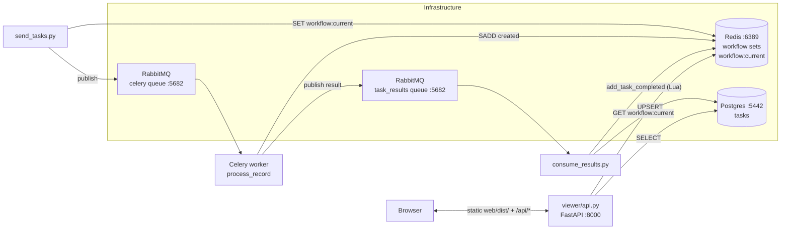

# Celery Task Viewer POC

Run a Celery workflow, persist each task's result + execution metrics to Postgres, and browse the parent/child hierarchy in a React Flow viewer.

## Architecture



Three concerns kept apart:

- **`outbox/`** — Celery tasks, Redis-set workflow tracking, enriched result publishing.
- **`consume_results.py`** — RabbitMQ consumer. On terminal events, UPSERTs a row into Postgres with the business result and a bundled `metrics` JSONB.
- **`viewer/` + `web/`** — FastAPI backend + React Flow frontend for browsing the hierarchy.

## Services and ports

| Service  | Port  | Purpose                                   |
| -------- | ----- | ----------------------------------------- |
| RabbitMQ | 5682  | Celery broker + `task_results` queue      |
| Redis    | 6389  | Workflow sets + `workflow:current` pointer|
| Postgres | 5442  | Durable `tasks` table for the viewer      |
| FastAPI  | 8000  | API + static frontend                     |

All three backends use **non-default ports** to stay out of the way of other local installs.

## One-time setup

### 1. Install dependencies

```bash
poetry install
cd web && npm install && cd ..
```

### 2. Start services

If you don't already have them running:

```bash
docker compose up -d
```

This brings up RabbitMQ, Redis, and Postgres. Postgres runs `ops/postgres/init.sql` on first boot to create the `tasks` table + indexes.

If you already have a Postgres instance on port 5442 (e.g. from another compose stack), create the DB and apply the schema manually:

```bash
# replace <admin_user> with your existing superuser
createdb -h localhost -p 5442 -U <admin_user> celery_viewer
psql -h localhost -p 5442 -U <admin_user> -d celery_viewer \
  -c "CREATE USER celery WITH PASSWORD 'celery';"
psql -h localhost -p 5442 -U <admin_user> -d celery_viewer \
  -c "GRANT ALL ON DATABASE celery_viewer TO celery;"
psql -h localhost -p 5442 -U celery -d celery_viewer \
  -f ops/postgres/init.sql
```

### 3. Build the frontend

```bash
cd web && npm run build && cd ..
```

Output lands in `web/dist/`, which FastAPI serves as static files.

## Running the POC

You need **four processes**, typically one per terminal. Run each from the project root.

### Terminal 1 — Celery worker

```bash
poetry run celery -A outbox.celery_app worker \
  --pool=threads --concurrency=4 --loglevel=info
```

### Terminal 2 — result consumer (persists to Postgres)

```bash
poetry run python consume_results.py
```

### Terminal 3 — API + viewer

```bash
poetry run uvicorn viewer.api:app --host 127.0.0.1 --port 8000
```

### Terminal 4 — submit a workflow

```bash
poetry run python -m outbox.send_tasks
```

Then open **http://localhost:8000** in a browser. The default sample workflow contains 5 tasks; one deliberately retries twice before succeeding, so you can see retry counts and a slower duration on that node.

## Using the viewer

- Root node is visible on load; its children are collapsed. Click a node to toggle collapse/expand, and to open the detail pane on the right.
- The detail pane shows the business result (`last_message`) and a bundled `metrics` block (retry count, duration, timestamps).
- The top bar has **Slowest**, **Most retries**, and **Failed** highlight buttons. Matching nodes get a yellow outline. If a match is hidden inside a collapsed subtree, its ancestors auto-expand.

## Viewer API reference

| Method | Path                                                         | Returns                              |
| ------ | ------------------------------------------------------------ | ------------------------------------ |
| GET    | `/api/workflows/current`                                     | `{workflow_id}` (from Redis), or 404 |
| GET    | `/api/workflows/{id}/tasks`                                  | all persisted tasks for the workflow |
| GET    | `/api/workflows/{id}/tasks/{task_id}`                        | one task with `last_message + metrics` |
| GET    | `/api/workflows/{id}/highlights?by=slowest\|most_retries\|failed` | sorted/filtered task_ids            |

## Verifying a run from the CLI

```bash
docker exec -e PGPASSWORD=celery <postgres_container> \
  psql -U celery -d celery_viewer -c "
    SELECT record_id, final_status,
           parent_task_id IS NULL AS is_root,
           metrics->>'retry_count'       AS retries,
           metrics->>'total_duration_ms' AS duration_ms
    FROM tasks
    ORDER BY record_id;"
```

Expected for the sample workflow: 5 rows, one `is_root = t`, `record_id=2` with `retries=2`.

## File layout

```
.
├── outbox/                  Celery app + workflow tracking
│   └── README.md
├── viewer/                  FastAPI backend
│   └── README.md
├── web/                     React Flow frontend
│   └── README.md
├── consume_results.py       RabbitMQ consumer + Postgres persister
├── ops/postgres/init.sql    Schema applied on first Postgres boot
├── docker-compose.yml       RabbitMQ + Redis + Postgres
└── pyproject.toml
```

## Troubleshooting

- **"No current workflow" in the browser** — `workflow:current` isn't set in Redis. Run `poetry run python -m outbox.send_tasks` and reload.
- **"Workflow has no persisted tasks yet"** — `consume_results.py` isn't running, or the workflow is still executing. Tasks only appear after they reach a terminal state (`success`, `permanent_failure`, `transient_failure_exhausted`).
- **Old payloads in the queue** — if you see `Skipping malformed payload` in the consumer log, those are messages from a previous worker version. Purge the queue: `docker exec <rmq> rabbitmqctl purge_queue task_results`.
- **Multiple workers competing** — if you see the Celery warning `A node named celery@<host> is already using this process mailbox`, an older worker is still running. Find and kill it: `ps aux | grep 'celery.*worker'`.
